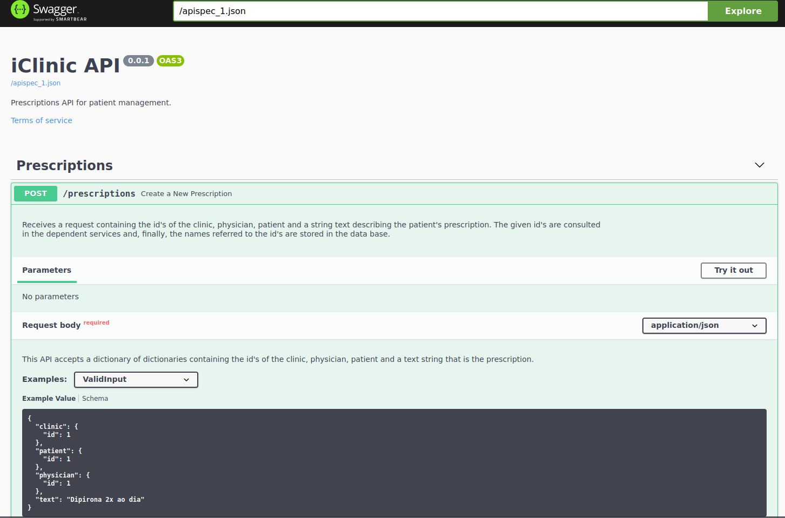

# iClinicAPI
A Flask API developed as a solution to iClinic Back-end Developer Challenge. More information about this challenge can be obtained [here](https://github.com/iclinic/iclinic-python-challenge).

## Run the Project

You can run this project in two ways: Using docker or not.

## Without docker :(

Install the requirements (from pipfile or requirements.txt) on a virtual environment of your preference.

Start the server using the following command:

```bash
python main.py
```

## Using Docker :)


Clone this repo and, inside the root folder of this project, use the following commands:

```bash
docker image build . -t iclinic:latest

docker run --network=host iclinic:latest
```

In your browser, access the following link ```localhost:5000/apidocs``` and you will able to see the application swagger like below:


