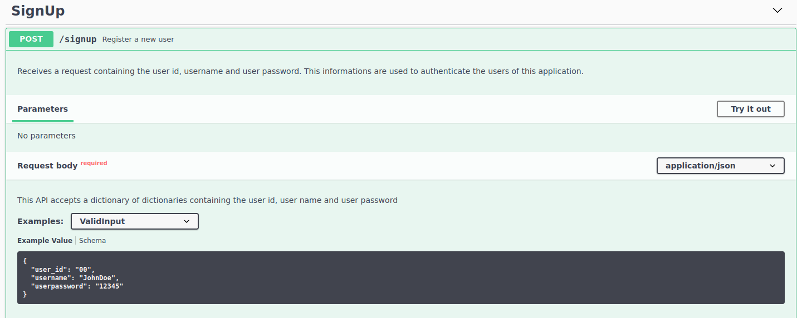

# iClinicAPI
A Flask API developed as a solution to iClinic Back-end Developer Challenge. More information about this challenge can be obtained [here](https://github.com/iclinic/iclinic-python-challenge).

## Deploying

You can run this project in two ways: Using docker or not.

For deploying this application without docker, install the requirements (from pipfile or requirements.txt) on a virtual environment of your preference.

Start the server using the following command:

```bash
python main.py
```

### Deploying with Docker :)


Clone this repo and, inside the root folder of this project, use the following commands:

```bash
docker image build . -t iclinic:latest

docker run --network=host iclinic:latest
```

In your browser, access the following link ```localhost:5000/apidocs``` and you will able to see the application swagger like below:


## Sending requests

Firstly you must register a valid user. You can do it registering an user using /signup route. Send a post request to /signup as shown in the example available on the application's swagger:



```bash
curl -X POST \
  http://localhost:5000/signup \
  -H 'Content-Type: application/json' \
  -d '{
	"user_id": "00",
	"username": "JohnDoe",
	"userpassword": "12345"
}'
```

If the registration process was successful, you receive "user registered" as server response. Now you are a registered user, you can request a JWT token to be able to register new prescriptions. 

Send a post request to /auth route with request body as shown on the below example:

```bash
curl -X POST \
  http://localhost:5000/auth \
  -H 'Content-Type: application/json' \
  -d '{
	"user_id": "00",
	"username": "JohnDoe",
	"userpassword": "12345"
}'
```

The response will be a JWT token and now you can use this token to send requests to /prescription route. An example:

```bash
curl -X POST \
  https://mock-api-challenge.dev.iclinic.com.br/metrics/ \
  -H 'Authorization: JWT xxxxxxxxxxxxxxxxxxxxxxxxxxxxxxxxxxxxxxxxxxxxx \ # Replace the "xxxx..." by your JWT token
  -H 'Content-Type: application/json' \
  -d '{
  "clinic_id": 1,
  "clinic_name": "Clínica A",
  "physician_id": 1,
  "physician_name": "José",
  "physician_crm": "SP293893",
  "patient_id": 1,
  "patient_name": "Rodrigo",
  "patient_email": "rodrigo@gmail.com",
  "patient_phone": "(16)998765625",
  "prescription_id": 1
}'```